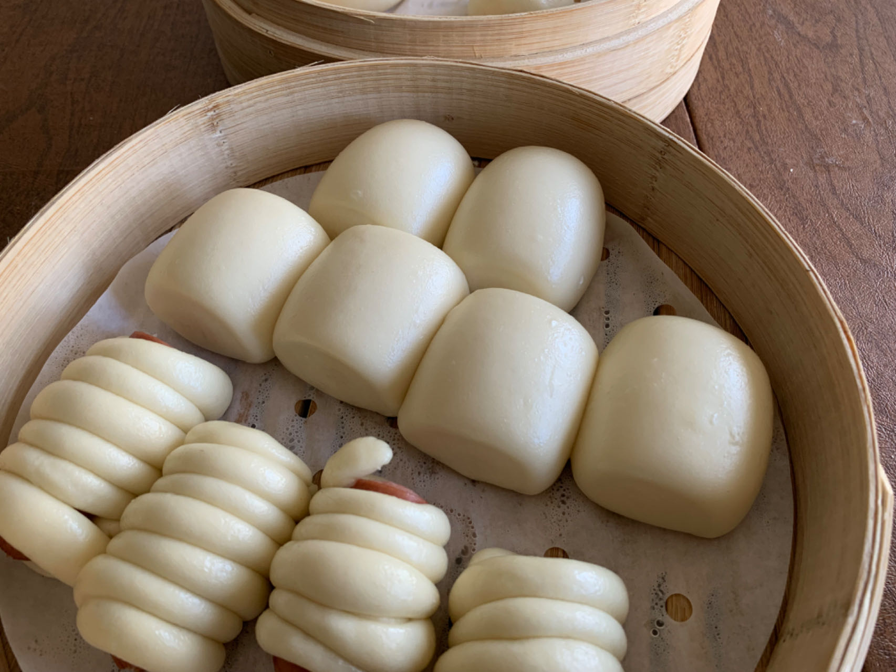
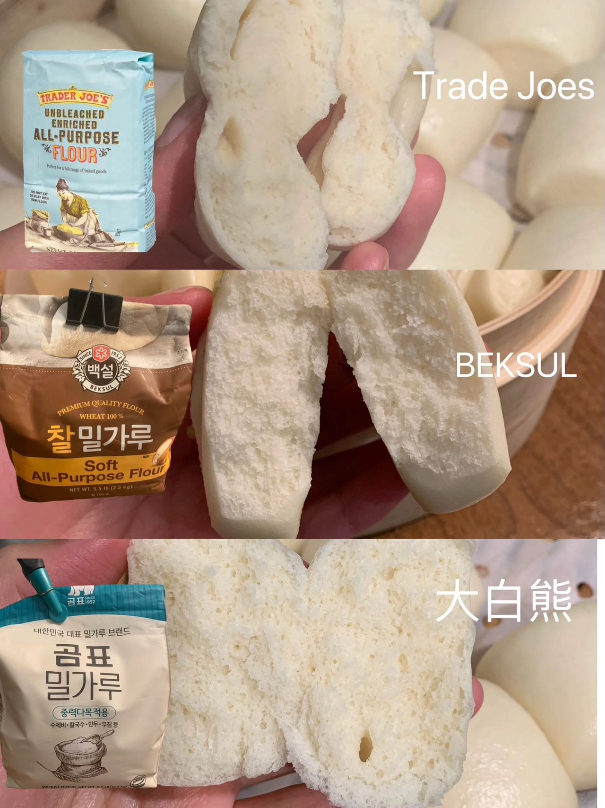
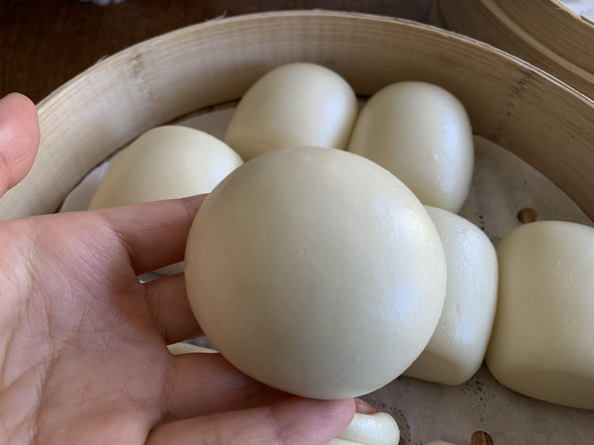

这个食谱做出来的包子馒头更偏南方的口感，蓬松软，北方可能更喜欢筋道的口感，可以用all-purpose flour，揉得更久一些。

注意点:

0. 面粉和水的重量比例大约为2:1，但是由于面粉的吸水性不同，水的重量应该适当调整，可以先加80%水，如果揉到最后觉得偏干，再加剩下的水。新手不建议这么做，用常规牌子(Trade Joe all purpose, medal, king arthur, beksul，gompyo等)按照2:1比例走通一遍流程。
1. 不论是用手揉还是揉面机，都需要在面团成型后再加油(猪油/椰子油/蔬菜油)。
2. 水光肌的馒头用机器更容易，美国的压面机指的是压意大利面的面条压面机，与国内经常提及的压面机两者的区别是美国压面机/压面配件一般是压0.1-4mm厚度的面团，国内的压面机是0.1-20mm，因此国内的压面机用途更广泛，可以压厚一些的面团。用压面机可以适当减少水份约10%。如果觉得粘，应该加一些干面粉。
3. 发酵不要过头，尽可能开空调控制温度。酵母发酵需要小于35摄氏度。发酵时间控制在40分钟内。发酵时候需要盖盖子，要保持一定的湿度。
4. 韩国超市的韩国面粉更好用(白，柔软)，也会打折，比如Hankook买到的4刀/5磅的大白熊面粉。
5. 酵母的购买和知识可以参考[这篇文章](https://www.dealmoon.com/guide/948762)。

## 面粉影响

面粉对口感影响参照下图:

Trade joes 是美国超市的all purpose flour。BEKSUL是韩国超市的中筋面粉。最后一个是gompyo的小麦面粉/低筋面粉。可以看到低筋面粉出来的效果更像蛋糕组织，松软有弹性。

## 气泡
制作过程中不论是美国超市还是亚洲超市的面粉都容易出气泡，直接手工压面很难把气泡压干净，可以搓成小面团再逐个击破揉掉气泡。

揉搓掉气泡后:

