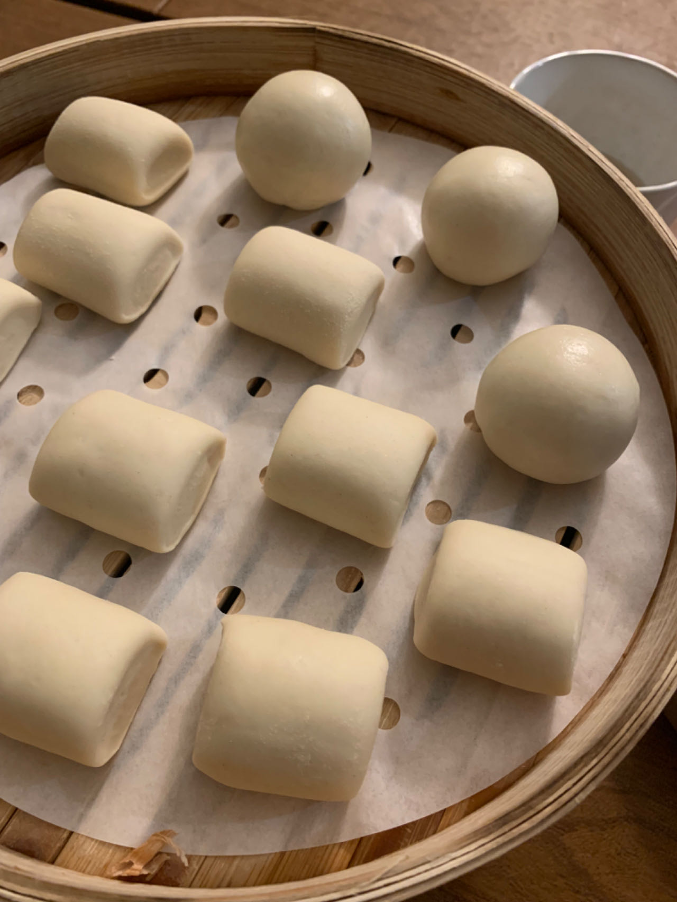
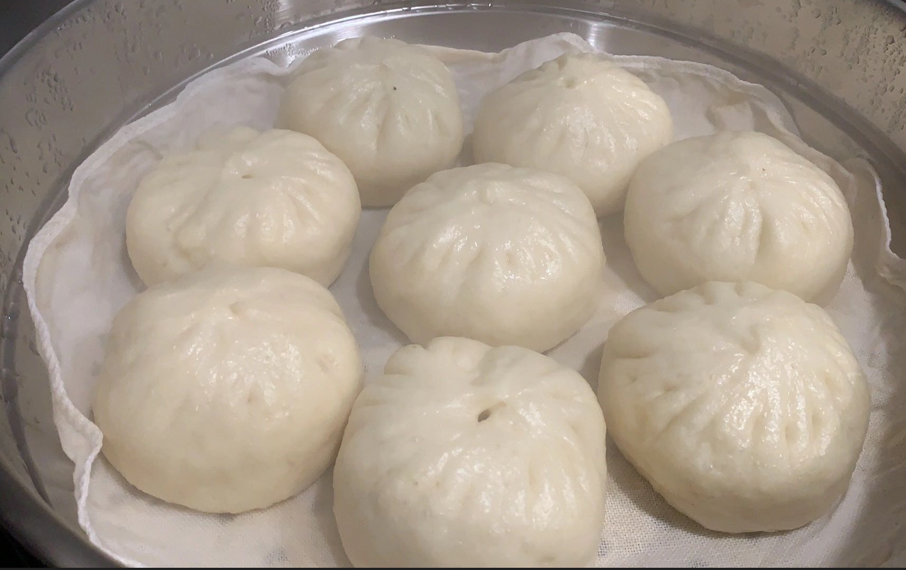

## 包子

[视频流程](https://www.bilibili.com/video/BV1zC4y1A7LQ/?spm_id_from=333.999.0.0&vd_source=4838898a071fbf1c0e1abc180bd96552)

**耗时**: 1-1.5小时

**食材:**

*低/中筋面粉*: 250g
*白砂糖*: 15g
*水*: 125g
*泡打粉(可选)*: 2.5g
*猪油(可选)*: 4g
*全脂奶粉*: 少量

**馒头步骤**
1. 白砂糖和干酵母放一起加入水，搅拌让糖融化
2. 面粉中加泡打粉、奶粉(如果有)混合，倒到桌面上，再用刮刀打窝，在窝里加入 1 的酵母糖水。用手把逐步把部分粉和窝当中的水混合变成浆状到液体不流动的状态，把所有粉和粉浆搓一起，变成面团。搓的过程中，加入猪油。
3. 揉面团到光滑后，用毛巾或者盆盖一下(松筋5-10分钟)。
4. 压面: 可以用压面机来回压 5、6 次。也可以手工用擀面杖压。
5. 卷面: 擀平面团，喷一些水，从面团的一边开水卷面。
6. 把面团搓成均匀长条，用刀切成一个个的小剂子，因为面团可能会粘，可以把剂子放到不粘纸上或者沾一点干粉。
7. 送入发酵箱发酵 25 分钟。发酵温度<=35 摄氏度。或者用一盆热水，参照视频。
8. 醒发好的馒头放入蒸箱 8 分钟即可。家庭蒸锅，水烧开10分钟左右。

## 拓展

**包子**

包子皮的做法同上面的步骤1-6，剂子重量约30-35g可以做一个小包子，馅料可以控制在20克左右，这个皮还是很柔韧不容易破的。

包子馅的做法要注意含有水份的菜馅需要尽可能把水挤干，用干净的干毛巾或者过滤袋挤干！

包包子的各种手法可以参见各种网络视频。

包完的包子再送去发酵和蒸，参照上面步骤7、8。

含肉的包子需要蒸久一些。

