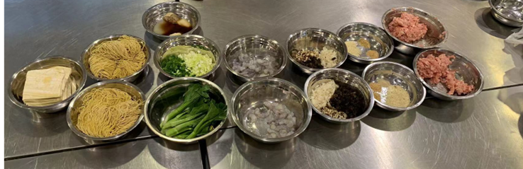

## 食材
云吞馅料:
1. 肉末 250g(已经调味)、马蹄 20g 切碎、冬菇切碎 20g、木耳 20g、
白芝麻(炒香)10g、大地鱼粉 5g、虾皮粉 5g、虾仁 50g(粗切)
2. 调味: 按照个人喜好盐、糖、胡椒粉、鸡粉适量
3. 调馅: 白芝麻、大地鱼粉、虾皮粉和肉末搅拌混合(A)，马蹄、冬
菇、木耳和2中的调味混合(B)，将 A 和 B 再混合。如果是做云吞
面，再把虾仁加入，混合。

虾皮粉: 虾皮用平底锅中小火烤干，料理机打碎即可。
大地鱼粉: 大地鱼烤箱150C烤干(约10分钟)，料理机打碎。

云吞面高汤:
1. 高汤调味: 20g 盐、30g 鸡粉、40g 糖、1g 胡椒粉、10g 生抽、麻
油 1g、米酒 20g
2. 猪骨或鸡骨架焯水后，放入锅子里，按照半斤骨头五斤水的比例
加水，加入几个香菇、葱段、姜片熬煮，加入大地鱼和虾皮(15g
左右)，加一点点陈皮，汤熬制好了，加入所有调味料。

## 制作
云吞面:
1.	煮云吞: 大火烧开水，加云吞煮熟，捞出
2.	煮竹升面，烫1分钟，筷子拨散，捞起，过冷水 (洗掉碱水味以及让面更Q弹)。
3.	烫一些青菜。
4.	碗里先放面，然后放云吞和青菜，倒入高汤，撒韭黄和葱花即可

炸云吞:
1. 锅里加油，烧到六七分热，加入云吞，慢慢炸(因为里面的猪肉不
易熟)，炸到表面金黄熟透，捞出沥油即可。

炸云吞的云吞里面不放虾仁。

